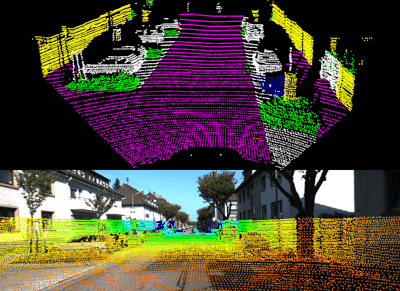
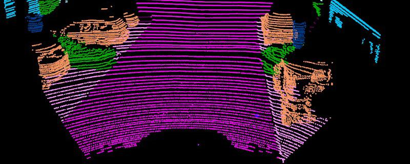
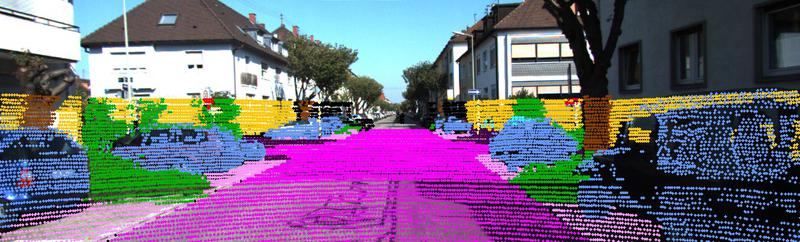
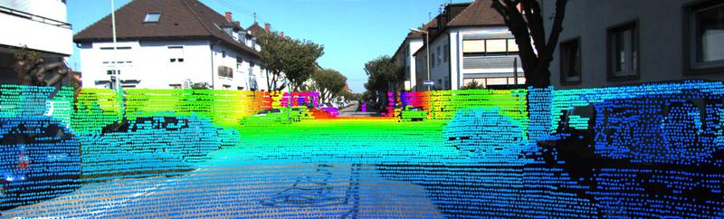
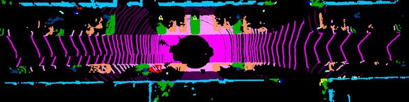

# Open3D Semantic KITTI visualization tool

- This tool is modified from [https://github.com/windowsub0406/KITTI_Tutorial], and use Semantic KITTI dataset from [http://semantic-kitti.org]
- The class difinations are in their ICCV 2019 paper "SemanticKITTI: A Dataset for Semantic Scene Understanding of LiDAR Sequences" [https://arxiv.org/abs/1904.01416]
- The tool supports voxel based point cloud downsampling, FOV and range based filtering.



## Installation

Download Semantic KITTI label file from [http://semantic-kitti.org/assets/data_odometry_labels.zip] and unzip it along with KITTI odometry dataset [http://www.cvlibs.net/datasets/kitti/eval_odometry.php].

```bash
conda install -c open3d-admin open3d
git clone https://github.com/Jiang-Muyun/Open3D-Semantic-KITTI-Vis.git
cd Open3D-Semantic-KITTI-Vis
pip install -r requirements.txt
```

## Run

```bash
python vis_velo.py --cfg config/ego_view.json --root PATH_TO_KITTI/odometry/dataset/
python vis_velo.py --cfg config/top_view.json --root PATH_TO_KITTI/odometry/dataset/
```

Create a new view from existing ones and modify the viewing angle.

```bash
cp config/ego_view.json config/new_view.json

# Press [Q] to save the view
# Then you can modify the FOV and range filter arguments in new_view.json
python vis_velo.py --cfg config/new_view.json --root PATH_TO_KITTI/odometry/dataset/ --modify
```




